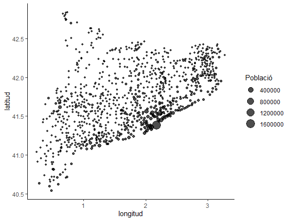

# POBLACIONS GEOCAT

Programa per recuperar les coordenades de les poblacions de Catalunya segons les dades proveïdes per l'Institut Cartogràfic i Geològic de Catalunya.

Les poblacions les recuperem d'una exportació directa de l'ICGC a data de 27 d'agost, 2025 i es troba a `t150903.csv`.

Farem servir la API pública per obtindre les coordenades:

*Cerca de "Cardedeu":* <https://eines.icgc.cat/geocodificador/autocompletar?text=cardedeu&size=1&layers=tops>

*Resultat:*

``` json
{
    "type":"FeatureCollection",
    "features":[{
        "type":"Feature",
        "geometry":{
            "type":"Point",
            "coordinates":[2.35595316,41.63852816]
        },
        "properties":{
            "layer":"tops",
            "addendum":{
                "zoom":17,
                "id_tipus":1,
                "tipus":"Cap de municipi","origen":"5000",
                "municipis_extra":""
            },
            "nom":"Cardedeu",
            "id_municipi":"080462",
            "municipi":"Cardedeu",
            "id_comarca":"41",
            "comarca":"Vallès Oriental","etiqueta":"Cardedeu"
        }
    }],
    "crs":{
        "type":"name",
        "properties":{
            "name":"urn:ogc:def:crs:OGC:1.3:CRS84"
        }
    }
}
```

Això ens permet situar els punts al mapa:


